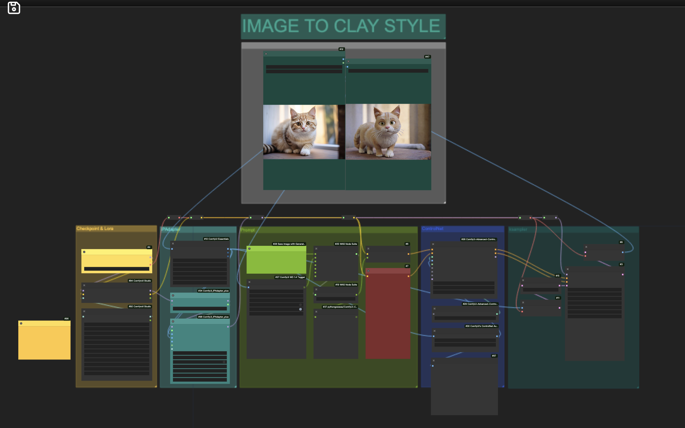

# Comfyui_workflow
comfyui工作流分享

## 黏土风格工作流
实现黏土风格，使用WD1.4 Tagger反推提示词，直接上图片，无需修改prompt一键生成
SDXL+IPAdapter+Lora+ControlNet
## Notes
使用的Checkpoint模型: [JuggernautV8XL](https://civitai.com/models/133005/juggernaut-xl)

Lora模型：
#### DD-made-of-clay-XL-v2

wget镜像下载
```
wget -c https://files.loopin.network/docs/tutorials/comfyui/DD-made-of-clay-XL-v2.safetensors

```
#### CLAYMATE_V2.03
wget镜像下载
```
wget -c https://files.loopin.network/docs/tutorials/comfyui/CLAYMATE_V2.03_.safetensors
```
Controlnet模型:[control-LoRAs-rank256](https://hf-mirror.com/stabilityai/control-lora/tree/main/control-LoRAs-rank256) 

IPAdapter模型：[IP-Adapter](https://hf-mirror.com/h94/IP-Adapter/tree/main)

#### 工作流


## 效果图
 


